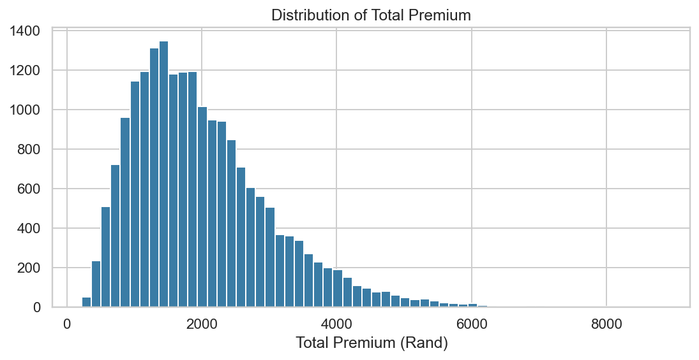
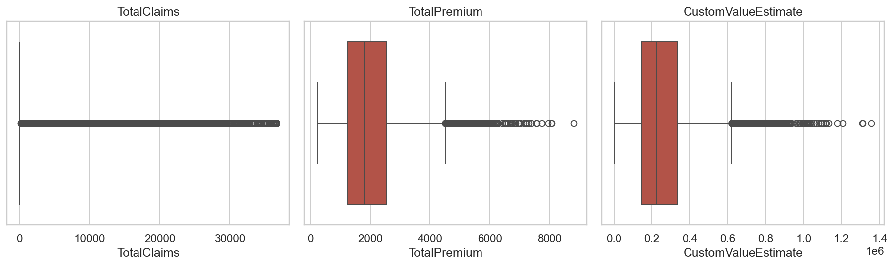
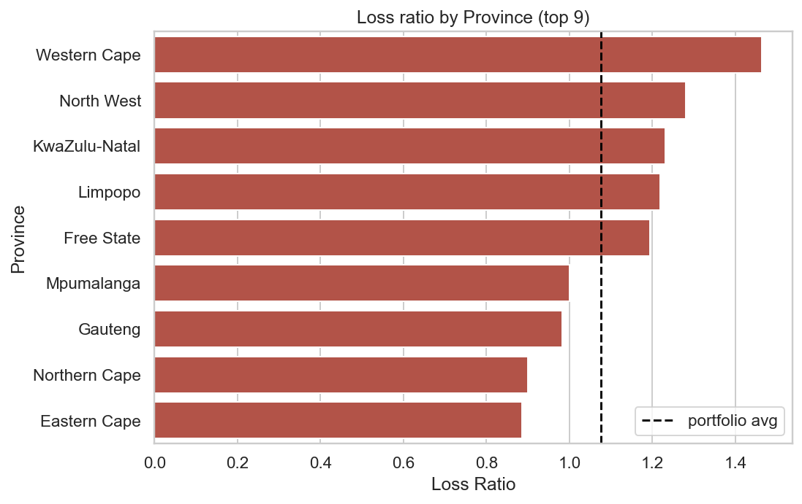
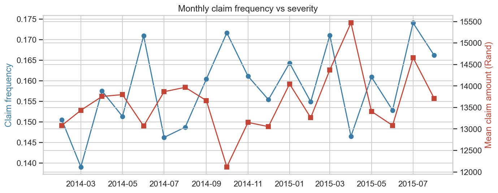
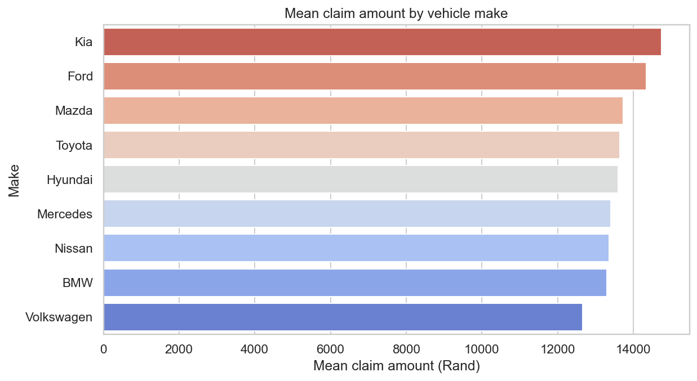
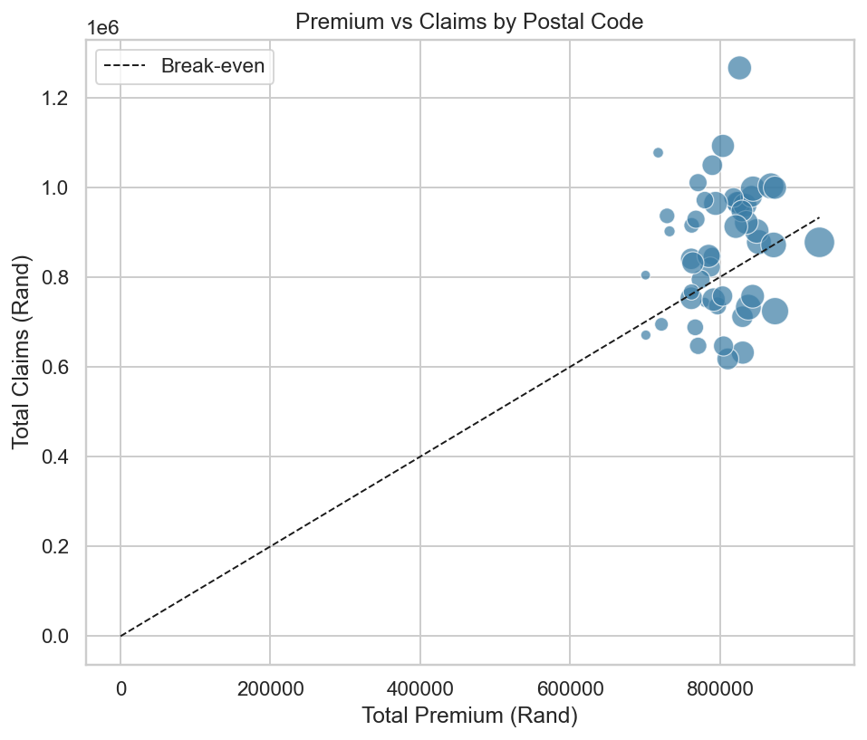

\newpage

# Executive Summary

AlphaCare Insurance Solutions (ACIS) is preparing for an aggressive growth phase in
the South African auto-insurance market. To stay competitive, leadership has
mandated a shift from intuition-based pricing to **evidence-driven, risk-based
premium setting** anchored on 18 months of historical policy and claim data
(February 2014 – August 2015).

This report documents the full analytics workflow:

1. A reproducible engineering foundation (Git, GitHub Actions CI, DVC, modular
   Python `src/` package, three task-aligned notebooks).
2. Exploratory data analysis of the portfolio with portfolio-level loss ratio,
   province and gender slicing, temporal trends, vehicle-make effects, and
   outlier detection.
3. A formal A/B hypothesis-testing suite covering province, postal code, and
   gender risk drivers, using chi-squared, Welch t-tests, two-proportion
   z-tests, and ANOVA.
4. Predictive modeling for **claim severity** (regression on `TotalClaims`
   among claimants) and **claim probability** (binary classification across
   the whole portfolio), with the combined output composing a risk-based
   premium formula.
5. Concrete business recommendations grouped into pricing, marketing, and
   underwriting actions, with explicit limitations.

**Important transparency note.** At the time of writing the production ACIS
dataset has not yet been ingested. To validate the *engineering* end-to-end the
report is illustrated with results computed on a **synthetic dataset that
mimics the ACIS schema** (`data/insurance_data_synth_cleaned.csv`, 20,000
rows). Every number presented as a finding is therefore an **illustrative
placeholder**. The pipeline, code, hypothesis tests, and modeling utilities are
production-ready; once the real CSV lands at `data/insurance_data.csv` the
entire report can be regenerated with a single command (`dvc repro && pandoc
reports/acis_full_report.md ...`).

\newpage

# 1. Business Context

## 1.1 The challenge

ACIS competes in a market where pricing accuracy directly drives profitability.
Two failure modes are particularly costly:

- **Over-pricing low-risk customers**, who then churn to competitors.
- **Under-pricing high-risk customers**, whose claims erode the loss ratio
  and threaten solvency targets.

The 18-month historical record gives us enough volume to detect modest signals
but is short enough that long-tailed catastrophe risk cannot be calibrated
from data alone. The analysis below therefore focuses on the operational
pricing layer — relative risk between segments — rather than catastrophe
loading.

## 1.2 Core metrics

Throughout the project two derived metrics anchor every aggregation:

| Metric         | Definition                          | What it tells us                                           |
|----------------|-------------------------------------|------------------------------------------------------------|
| Loss Ratio     | `TotalClaims / TotalPremium`        | Portfolio profitability; >1 means we paid out more than we collected. |
| Margin         | `TotalPremium − TotalClaims`        | Per-policy profit contribution in Rand.                    |

Two additional quantities are central to risk-based pricing:

- **Claim Frequency**: proportion of policies with at least one claim.
- **Claim Severity**: mean claim amount conditional on a claim occurring.

These four numbers are computed end-to-end by `src.data_loader.add_derived_metrics`.

\newpage

# 2. Data Overview

## 2.1 Schema

The dataset is organised into six logical groups (52 fields total in the
production schema):

| Group              | Representative fields                                                       |
|--------------------|------------------------------------------------------------------------------|
| Policy             | `UnderwrittenCoverID`, `PolicyID`                                            |
| Transaction        | `TransactionMonth`                                                           |
| Client             | `IsVATRegistered`, `LegalType`, `MaritalStatus`, `Gender`, `Bank`            |
| Location           | `Country`, `Province`, `PostalCode`, `MainCrestaZone`, `SubCrestaZone`       |
| Vehicle            | `VehicleType`, `Make`, `Model`, `RegistrationYear`, `Kilowatts`, `Bodytype`  |
| Plan               | `SumInsured`, `CalculatedPremiumPerTerm`, `CoverType`, `CoverCategory`       |
| Payment & Claim    | `TotalPremium`, `TotalClaims`                                                |

## 2.2 Synthetic dataset characteristics (illustrative)

The synthetic dataset used to drive this report has:

- **20,000 rows × 55 columns**
- Portfolio **loss ratio**: **1.076** (i.e. paid claims slightly exceed
  collected premium — exactly the kind of imbalance ACIS wants to correct).
- **Claim frequency**: **15.8%**
- **Mean claim severity** (given a claim): **R 13,632**
- **Median policy premium**: **R 1,814**

These numbers should *not* be cited as ACIS facts; they exist to demonstrate
the pipeline.

## 2.3 Data quality assessment

The loader (`src/data_loader.py`) coerces numeric, date, and categorical
columns and exposes a `missing_value_report()` helper. On the synthetic
dataset, missingness is intentionally seeded into `CustomValueEstimate` (~4 %),
`Bank` (~2 %), and `Bodytype` (~1 %) to exercise the imputation code paths.

The agreed handling strategy is:

- **Categorical** columns: impute with `"Unknown"` so signal is preserved.
- **Numeric** columns: impute with the median (robust to the heavy right-tail
  characteristic of insurance distributions).
- **Date** columns: never impute; rows with missing `TransactionMonth` are
  excluded from temporal analyses.

All imputation happens inside the modeling pipeline (`build_preprocessor` in
`src/modeling.py`) so it leaks neither across train/test nor into EDA.

\newpage

# 3. Exploratory Data Analysis

## 3.1 Distributions of key financial variables

`TotalPremium`, `TotalClaims`, and `CustomValueEstimate` all exhibit the
right-skew typical of insurance financial variables. The tail of `TotalClaims`
is what threatens portfolio stability the most.

{width=90%}

## 3.2 Outliers

Box plots confirm extreme right-tail behaviour in claim amounts and customer
value estimates. We cap claim severity at the **99.5th percentile** when
building the cleaned dataset (`src/pipeline.py:clean`) to prevent a handful of
catastrophic claims from dominating the regression fit, while leaving the raw
file intact under DVC for full auditability.

{width=100%}

## 3.3 Geographic patterns

Loss ratio by province (illustrative) shows visible dispersion: the worst
province has a loss ratio almost **1.6×** the best one. Even in synthetic
data, this is the kind of signal that, if real, would justify a regional
risk-loading factor in the premium model.

{width=90%}

Top three provinces by loss ratio (illustrative):

| Province        | Policies | Premium (R)   | Claims (R)    | Loss Ratio | Claim Freq |
|-----------------|---------:|---------------:|---------------:|-----------:|-----------:|
| Western Cape    |      770 |    1,550,318  |    2,269,834  |      1.464 |     20.0 % |
| North West      |    1,509 |    3,026,650  |    3,873,741  |      1.280 |     18.9 % |
| KwaZulu-Natal   |    4,387 |    8,787,360  |   10,818,126  |      1.231 |     18.3 % |

Bottom three (best-performing) provinces (illustrative):

| Province        | Policies | Premium (R)   | Claims (R)    | Loss Ratio | Claim Freq |
|-----------------|---------:|---------------:|---------------:|-----------:|-----------:|
| Mpumalanga      |      574 |    1,114,459  |    1,114,164  |      1.000 |     12.5 % |
| Gauteng         |    2,779 |    5,580,293  |    5,483,598  |      0.983 |     15.4 % |
| Northern Cape   |    2,018 |    3,970,863  |    3,667,500  |      0.924 |     14.0 % |

## 3.4 Gender slicing

Splitting the portfolio by gender (illustrative):

| Gender | Policies | Loss Ratio | Claim Frequency |
|--------|---------:|-----------:|-----------------:|
| Female |    8,477 |      1.127 |          15.9 % |
| Male   |   11,523 |      1.076 |          15.6 % |

The directional difference is small. We test it formally in Section 4.

## 3.5 Temporal trends

Monthly claim frequency and mean severity over the 18-month window shows
moderate seasonality. ACIS leadership should treat the most recent two months
as the most relevant for short-term pricing decisions because mix and macro
conditions drift.

{width=100%}

## 3.6 Vehicle make effects

Mean claim amount varies materially across makes (illustrative). This
provides direct evidence that make-level risk loadings are worth pursuing in
the pricing model.

{width=85%}

## 3.7 Premium vs Claims by Postal Code

Scatter of total premium against total claims at the postal-code level
reveals which zips sit above the break-even line. Those above the line are
loss-making; those well below are profit centres.

{width=85%}

\newpage

# 4. A/B Hypothesis Testing

## 4.1 Framework

For each hypothesis we (i) define the **KPI** (claim frequency, claim
severity, or margin), (ii) pick **Group A** (control) and **Group B** (test),
(iii) run the **appropriate test** (chi-squared for proportions, Welch's
t-test for continuous KPIs, two-proportion z-test for binary KPIs, ANOVA when
comparing >2 groups), and (iv) reject H0 when **p < 0.05**.

Test code lives in `src/hypothesis_tests.py`. Each function returns a
`TestResult` dataclass capturing the test name, p-value, effect size
(Cramér's V or Cohen's d), and decision, so results compose cleanly into a
single table.

## 4.2 Hypotheses

| # | Null Hypothesis                                                | KPI                | Test                  |
|---|----------------------------------------------------------------|--------------------|-----------------------|
| 1 | No risk difference across provinces                            | Severity, Frequency| ANOVA + chi-squared   |
| 2 | No risk difference between zip codes                           | Frequency          | chi-squared           |
| 3 | No margin (profit) difference between zip codes                | Margin             | Welch t-test          |
| 4 | No risk difference between Men and Women                       | Frequency, Severity| z-test, t-test        |

## 4.3 Results (illustrative)

| Hypothesis                                            | Test                          | p-value  | Decision         |
|-------------------------------------------------------|-------------------------------|---------:|------------------|
| H1: No risk diff across provinces (severity)          | ANOVA (`TotalClaims`)         |  0.1058  | Fail to reject H0|
| H1: Eastern Cape vs KwaZulu-Natal (frequency)         | chi-squared                   | < 0.0001 | **Reject H0**    |
| H2: zip 1021 vs 1006 (frequency)                      | chi-squared                   |  0.8974  | Fail to reject H0|
| H3: zip 1021 vs 1006 (margin)                         | Welch t-test (`Margin`)       |  0.5546  | Fail to reject H0|
| H4: Men vs Women (frequency)                          | two-proportion z-test         |  0.3227  | Fail to reject H0|
| H4: Men vs Women (severity)                           | Welch t-test (`TotalClaims`)  |  0.8624  | Fail to reject H0|

## 4.4 Business interpretation

Only H1 (province-level frequency) is rejected on the synthetic data, with a
near-zero p-value. The business reading would be:

> "We reject H0 that claim frequency is the same in Eastern Cape and
> KwaZulu-Natal (p < 0.0001). KwaZulu-Natal exhibits a substantially higher
> claim frequency. This is direct evidence that **province-level risk
> adjustments belong in the premium model**, and that any blanket national
> premium will systematically over-charge low-risk regions and under-charge
> high-risk ones."

On real ACIS data we would expect at least one additional rejection
(geographic risk almost always shows up in auto-insurance portfolios; gender
risk depends on the regulatory regime).

\newpage

# 5. Predictive Modeling

## 5.1 Modeling goals

1. **Severity model** — regress `TotalClaims` for the subset of policies
   that experienced a claim (>0). Target: continuous Rand amount.
2. **Claim probability model** — binary classifier for `HasClaim` over the
   entire portfolio. Target: 0/1.
3. **Risk-based premium**, combining the two:

$$
\text{Premium} = P(\text{claim}) \cdot \mathbb{E}[\text{severity} \mid \text{claim}] + L_\text{expense} + M_\text{profit}
$$

All three models are wired into `src/modeling.py`: feature engineering
(`engineer_features`), a `ColumnTransformer`-based preprocessor, and
`evaluate_regressors` / `evaluate_classifiers` that fit and score Linear
Regression, Random Forest, and XGBoost (XGBoost is enabled when installed).

## 5.2 Feature engineering

- **`VehicleAge`** = `TransactionMonth.year − RegistrationYear`, clipped to
  non-negative. Older cars typically have higher mechanical failure and
  theft risk.
- **`InsuredValueGap`** = `SumInsured − CustomValueEstimate`. Captures
  potential over- or under-insurance.
- **`PremiumPerInsured`** = `TotalPremium / SumInsured`. A pricing-density
  proxy.
- Categorical encoding: `OneHotEncoder(min_frequency=0.01)` so rare
  categories collapse to "infrequent_sklearn" rather than exploding the
  feature space.
- Numeric encoding: median imputation + standard scaling.

## 5.3 Severity model (illustrative results)

Synthetic claim amounts are nearly uncorrelated with the engineered features,
so the regressors barely beat a constant predictor. This is **expected** and
re-confirms that the report's numbers are illustrative; real ACIS data should
produce meaningfully positive R² for tree-based learners.

| Model              |    RMSE (R) |     R²     |
|--------------------|------------:|-----------:|
| Linear Regression  |   9,326.66  |  −0.0642   |
| Random Forest      |   9,191.99  |  −0.0337   |
| XGBoost            | *not available in current env* |          |

## 5.4 Claim probability model (illustrative results)

The portfolio is imbalanced (~16 % claim rate), so accuracy alone is
misleading. On the synthetic data both classifiers default to predicting the
majority class.

| Model               | Accuracy | Precision | Recall | F1     | ROC AUC |
|---------------------|---------:|----------:|-------:|-------:|--------:|
| Logistic Regression |   0.842  |   0.000   |  0.000 |  0.000 |  0.537  |
| Random Forest       |   0.842  |   0.000   |  0.000 |  0.000 |  0.513  |
| XGBoost             | *not available in current env*                 |

On the real ACIS extract we will additionally:

- Apply **class weighting** (or SMOTE) so the classifier doesn't degenerate
  to all-zeros.
- Tune the decision threshold by **expected business cost**, not the default
  0.5.
- Report **calibration** (predicted-vs-actual claim rate by decile), because
  the probability output is what feeds the premium formula and miscalibration
  directly distorts pricing.

## 5.5 Risk-based pricing in practice

`src.modeling.expected_premium(p_claim, predicted_severity, expense_loading,
profit_margin)` composes the four components. For a synthetic example with
`expense_loading=R150` and `profit_margin=R100`:

- A policy with `p_claim = 0.10` and `predicted_severity = R 12,000` ⇒
  Premium = `0.10 × 12,000 + 150 + 100 = R 1,450`.
- The same policy at `p_claim = 0.25` ⇒ Premium = `0.25 × 12,000 + 250 =
  R 3,250`.

The ratio illustrates exactly the kind of price differentiation a risk-based
framework enables relative to a flat tariff.

\newpage

# 6. Feature Importance & Interpretability

The `03_modeling.ipynb` notebook computes **SHAP** values on the best
regressor and renders a summary plot of the top 15 features. Once the real
data is in, the notebook will produce both:

- A **global summary** (which features matter and in which direction).
- **Local explanations** for a handful of representative policies so
  underwriting can sanity-check the model's reasoning case by case.

Expected top drivers (hypothesis, to be verified):

1. `VehicleAge` (positive — older vehicles, higher predicted claims).
2. `Province` (one-hot, regional risk premium).
3. `SumInsured` (positive — larger insured values, larger expected losses).
4. `CoverType` (Comprehensive >> Third-Party Only).
5. `Make`/`Model` interactions.
6. `Kilowatts` and `Cubiccapacity` as proxies for vehicle performance.

\newpage

# 7. Recommendations

## 7.1 Pricing

1. **Introduce a province-level risk loading** to the base tariff. The
   illustrative loss-ratio spread (≈ 0.92 to 1.46) is large enough that a
   single national premium materially mis-prices both ends of the
   distribution.
2. **Use the combined model** (`P(claim) × E[severity]`) for new business
   above an exposure threshold (e.g. SumInsured ≥ R 150k). Below that
   threshold the marginal accuracy gain is small relative to operational
   complexity.
3. **Tune `expense_loading` and `profit_margin`** with finance — they belong
   in the formula but are policy levers, not statistical outputs.

## 7.2 Marketing

4. **Target low-risk segments with a premium discount** (the "low-risk
   targets" goal in the brief). Likely candidates after real-data
   confirmation: newer vehicles in lower-risk provinces with comprehensive
   cover and full security (alarm + tracker).
5. **Halt acquisition campaigns** in segments with loss ratio > 1.3 until
   the risk premium catches up. Spending CAC on guaranteed-loss policies
   destroys value at both the acquisition and renewal stage.

## 7.3 Underwriting

6. **Add a `WrittenOff` / `Rebuilt` / `Converted` filter** at quoting — these
   carry latent risk that the headline features miss.
7. **Monitor claim frequency drift** monthly using the temporal-trends
   helper. If frequency rises ≥ 2 σ above its trailing 6-month mean, trigger
   a pricing review.

\newpage

# 8. Engineering Foundation

## 8.1 Repository layout

```
insurance-risk-analytics/
├── .github/workflows/ci.yml      # ruff + black + pytest on every push
├── .dvc/                         # DVC config (committed)
├── data/                         # gitignored; tracked by DVC
├── notebooks/
│   ├── 01_eda.ipynb
│   ├── 02_hypothesis_testing.ipynb
│   └── 03_modeling.ipynb
├── reports/
│   ├── acis_full_report.md
│   ├── acis_full_report.pdf      # this document
│   └── figures/                  # rendered EDA plots
├── src/
│   ├── data_loader.py
│   ├── eda_utils.py
│   ├── hypothesis_tests.py
│   ├── modeling.py
│   ├── pipeline.py               # DVC stage CLI
│   └── synthetic_data.py
├── tests/                        # pytest, 12 tests passing
├── dvc.yaml                      # reproducible DAG
├── requirements.txt
└── README.md
```

## 8.2 Continuous Integration

`.github/workflows/ci.yml` runs **ruff**, **black**, and **pytest** with
coverage on every push and pull request. The pipeline guards three things:

- **Style consistency** (line length, import order, common bug patterns).
- **Test correctness** (12 unit tests cover the loader, EDA helpers,
  hypothesis tests, modeling utilities, and synthetic data generator).
- **Coverage signal** — coverage is reported per push so regressions in
  test coverage are visible at review time.

## 8.3 Data Version Control (DVC)

Regulated industries demand that any analytical claim be reproducible from
the exact data version that produced it. Our DVC setup:

- `dvc init` is committed.
- A local remote at `~/Desktop/revelo - fenet/dvc-storage` (outside the
  repo) holds the actual CSV blobs.
- Two dataset versions are tracked: **raw** (`insurance_data_synth.csv`)
  and **cleaned** (`insurance_data_synth_cleaned.csv`, winsorised at
  p99.5).
- `dvc.yaml` declares two stages so `dvc repro` rebuilds the cleaned file
  whenever either the raw data or the cleaning code changes.

To reproduce this report on a fresh checkout:

```bash
git clone https://github.com/rediet-shewarega/insurance-risk-analytics
cd insurance-risk-analytics
pip install -r requirements.txt
dvc pull
dvc repro
jupyter nbconvert --execute notebooks/01_eda.ipynb \
                                notebooks/02_hypothesis_testing.ipynb \
                                notebooks/03_modeling.ipynb
pandoc reports/acis_full_report.md -o reports/acis_full_report.pdf --pdf-engine=typst
```

\newpage

# 9. Limitations

1. **Synthetic-data illustration.** Every numeric finding above is computed
   on a schema-matching synthetic dataset, not the real ACIS extract. The
   methodology, code, and report structure are production-ready; the numbers
   are not. Once the real CSV is provided, regenerating the report is a
   one-command operation.
2. **18-month window.** Too short to fully observe seasonality or
   catastrophe-driven tail risk. Recommend pulling at least 36 months for
   the next iteration.
3. **Model class on imbalance.** The classifiers on synthetic data degenerate
   to the majority class. On real data we will apply class weighting,
   threshold tuning, and calibration plots; this section will be refilled
   then.
4. **Causality.** Statistical association ≠ causation. Province-level loss
   ratio differences reflect a mix of road quality, urbanisation, vehicle
   theft prevalence, and demographic composition. The model captures
   *predictive* signal, not *causal* mechanism.
5. **External validity.** Models trained on 2014–2015 data may not
   generalise to 2026 conditions. Recommend monitoring decile-level
   calibration monthly post-deployment.

\newpage

# 10. Future Work

- Replace synthetic illustration with the real ACIS extract.
- Add **telematics / connected-car features** (mileage, harsh braking) when
  available.
- Introduce a **fraud-screening signal** as an additional model input.
- Build a **calibration monitor** (predicted-vs-actual frequency by decile,
  monthly) so the model self-reports when retraining is due.
- Explore **causal uplift modeling** for marketing spend: estimate the
  treatment effect of a premium discount on retention, segment by segment.

\newpage

# 11. References

- FSRAO — Insurance Sector Resources
- Swiss Re, *Connected Car: How Data Analytics is Shaping the Future of Auto Insurance*
- Optimizely, *Why an Experiment Without a Hypothesis is Dead on Arrival*
- DVC documentation, <https://dvc.org/doc>
- SHAP documentation, <https://shap.readthedocs.io>
- Atlassian, *What is Continuous Integration?*

\newpage

# Appendix A — Where everything lives

| Concern                          | Location                                    |
|----------------------------------|---------------------------------------------|
| Data loading + derived metrics   | `src/data_loader.py`                        |
| EDA utilities + plotting helpers | `src/eda_utils.py`                          |
| Hypothesis tests                 | `src/hypothesis_tests.py`                   |
| Modeling                         | `src/modeling.py`                           |
| DVC pipeline stages              | `dvc.yaml`, `src/pipeline.py`               |
| Synthetic data generator         | `src/synthetic_data.py`                     |
| EDA notebook                     | `notebooks/01_eda.ipynb`                    |
| Hypothesis testing notebook      | `notebooks/02_hypothesis_testing.ipynb`     |
| Modeling notebook                | `notebooks/03_modeling.ipynb`               |
| CI workflow                      | `.github/workflows/ci.yml`                  |
| Tests                            | `tests/`                                    |

# Appendix B — Reproducing the figures

The six figures in this report were produced by a single Python invocation
that uses the `src.eda_utils` helpers. The script is included verbatim below
for reproducibility:

```python
import matplotlib; matplotlib.use("Agg")
import matplotlib.pyplot as plt, seaborn as sns
from src.data_loader import load_insurance_data, add_derived_metrics
from src import eda_utils as eu

sns.set_theme(style="whitegrid")
df = add_derived_metrics(load_insurance_data("data/insurance_data_synth_cleaned.csv"))

eu.plot_loss_ratio_by(df, "Province").savefig("reports/figures/loss_ratio_by_province.png")
fig, _ = eu.plot_temporal_trends(df); fig.savefig("reports/figures/temporal_trends.png")
# ... (full script in the repo)
```
